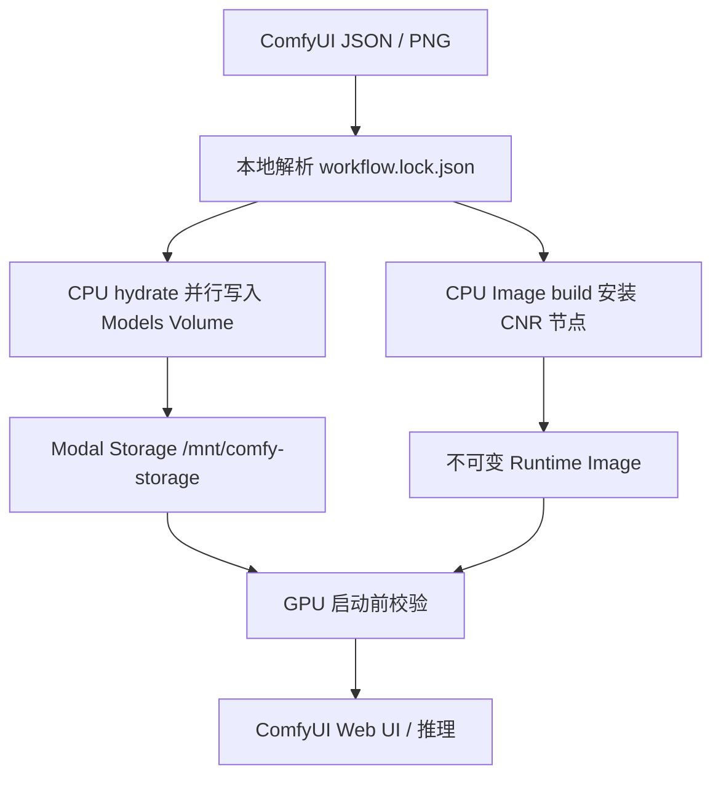

# modal-ashleykza-comfyui

在 Modal 上运行可复现的 ComfyUI，并把“解析别人的工作流、下载模型、安装自定义节点”前移到 CPU 阶段。GPU 容器只校验依赖、加载模型和执行推理，不在启动时联网下载资产。

项目按当前最新 Modal SDK（`pip install -U modal`，不指定版本）和 2026-08-13 的官方 [`llms.txt`](https://modal.com/llms.txt) 审计。

## 工作方式



| 阶段 | 运行位置 | 产物 | 是否使用 GPU |
|---|---|---|---|
| 解析工作流 | 本机 | `*.lock.json` | 否 |
| 下载模型 | Modal CPU Function | `/mnt/comfy-storage/<category>/...` | 否 |
| 安装工作流节点 | Modal Image build | Runtime Image | 否 |
| 启动与推理 | Modal GPU Function | Web endpoint | 是 |

模型放在独立的 Modal Storage Volume（目录名与 ComfyUI `models/<category>/` 一致）；稳定 custom nodes 放在不可变 Image。CPU hydrate 一次写入后，GPU 只挂载读取，冷启动不再联网下载。详见 [`docs/STORAGE.md`](docs/STORAGE.md)。

## 快速开始

要求 Python 3.12。本地始终安装**当前最新** Modal SDK：

```bash
python -m pip install -U modal
modal setup
```

查看已有 Profile：

```bash
modal run comfyui_modal.py --action profiles
```

先用 CPU 把模型 hydrate 进 Modal Storage，再启动 GPU UI。默认复用 Image 缓存；只有 `COMFY_LATEST=1` 才会重建节点 clone 层：

```bash
modal run comfyui_modal.py --action hydrate --profile qwen-image
COMFY_PROFILE=qwen-image modal serve comfyui_modal.py
```

持久部署默认复用 Image 缓存；若部署也要最新节点，加上 `COMFY_LATEST=1`：

```bash
COMFY_PROFILE=qwen-image modal deploy comfyui_modal.py
```

Windows PowerShell：

```powershell
modal run comfyui_modal.py --action hydrate --profile qwen-image
$env:COMFY_PROFILE="qwen-image"
modal serve comfyui_modal.py
```

## 根据别人的工作流自动准备依赖

支持 ComfyUI JSON，以及包含 `workflow` / `prompt` 文本元数据的 PNG。

### 1. 解析并在 CPU 同步模型

```bash
modal run comfyui_modal.py \
  --action hydrate \
  --workflow examples/z-image-base.json
```

这个命令会：

1. 在本地生成 `examples/z-image-base.lock.json`；
2. 拒绝路径穿越、非 HTTP(S) URL、冲突目标和非法哈希；
3. 把锁文件序列化给 CPU Function；
4. 用 4 个 worker 并行走 HF Xet / aria2，写入 `comfyui-ashleykza-models` Volume 并 `commit()`。

只想检查依赖、不下载：

```bash
modal run comfyui_modal.py \
  --action resolve \
  --workflow examples/other-workflow.png
```

自定义锁文件路径可加 `--lock-out path/to/workflow.lock.json`。

### 2. 构建节点并部署 GPU UI

```bash
COMFY_WORKFLOW_LOCK=examples/other-workflow.lock.json \
COMFY_PROFILE=base \
modal deploy comfyui_modal.py
```

Modal 会在 CPU Image build 中按锁文件里的 Comfy Registry `cnr_id` / `ver` 安装节点，并把锁文件嵌入 Image。GPU 容器启动时只检查模型是否存在且非空；缺失时立即失败并提示先运行 `hydrate`，不会偷偷下载。

PowerShell：

```powershell
$env:COMFY_WORKFLOW_LOCK="examples/other-workflow.lock.json"
$env:COMFY_PROFILE="base"
modal deploy comfyui_modal.py
```

### 元数据限制

自动下载依赖必须有可验证的来源。解析器优先使用 ComfyUI 工作流规范中的：

- `properties.models[]`: `name`、`url`、`directory`，以及可选 SHA256；
- `properties.cnr_id` / `properties.ver`: Comfy Registry 节点与版本。

如果工作流只保存了 `model.safetensors` 文件名、没有下载 URL，锁文件会把它列入 `unresolved`，`workflow-sync` 会停止。这时请在锁文件的 `models` 中补充 `category`、`filename`、`url`、可选 `sha256`，并移除对应的 `unresolved` 项后重试。项目不会猜测同名模型，以免拉错多 GB 权重。

没有 CNR 元数据的旧式或 Git-only custom node 无法从节点类型可靠反推仓库；请把它加入 `recipes.py` 的 `NODE_PACKS`。完整流程和锁文件说明见 [`docs/WORKFLOW_PREFETCH.md`](docs/WORKFLOW_PREFETCH.md)。

## 下载与存储

```text
Hugging Face  -> huggingface_hub + hf_xet
Civitai       -> aria2c -x16 -s16
普通 HTTP(S)  -> aria2c -x16 -s16
                         |
                         v
        Modal Volume comfyui-ashleykza-models
        /mnt/comfy-storage/{vae,text_encoders,diffusion_models,...}/
                         |
                         v
              extra_model_paths.yaml 1:1 映射
                         |
                         v
                    GPU 只读取
```

- `/ComfyUI`：基础镜像、venv、CUDA / torch、稳定 custom nodes；
- `/mnt/comfy-storage/<category>/`：模型（与 ComfyUI 目录同名）；
- `/workspace/input|output|user`：可变用户数据；
- `/workspace/custom_nodes`：实验节点；
- `/mnt/comfy-storage/.state/comfy.lock.json`：幂等 hydrate 状态；
- `/workspace/logs/comfyui.log`：ComfyUI 日志。

`extra_model_paths.yaml` 把 Storage Volume 标成 `is_default`，workspace `models/` 仅作旧数据回退。HF 下载开启 `HF_XET_HIGH_PERFORMANCE=1`；失败时回退 aria2。hydrate Function 使用 8 CPU / 16 GiB、默认 4 路并行、最长 6 小时、指数退避重试，并限制为一个容器写同一 Volume。旧 Volume 里已有的 `/workspace/models/...` 会在 hydrate 时复制进 Storage，不再重新下载。

已运行的容器不会自动看到其他容器刚提交的 Volume 变更。hydrate 完成后再 serve / deploy；如果 UI 已在运行，请让它启动新容器后再用新模型。

## Profile 与 Recipe

已有模型 Profile 包括 LTX 2.3、Nordy、Qwen Image、Flux、Wan 2.2 和原 Notebook 全量 Wan 组合。`wan22` 是较小的推荐组合；`wan22-notebook-full` 用于复刻原 Notebook 的启用节点。

在 `recipes.py` 中定义模型：

```python
"my-model": {
    "diffusion_models": (
        M(
            "https://huggingface.co/org/repo/resolve/main/model.safetensors",
            filename="vendor/model.safetensors",
            sha256="可选的64位SHA256",
        ),
    ),
}
```

定义固定版本节点：

```python
"my-nodes": (
    N(
        "https://github.com/example/ComfyUI-Example.git",
        ref="v1.2.3",
        requirements=("requirements.txt",),
    ),
)
```

组合 Profile：

```python
"my-profile": Profile(
    model_packs=("my-model",),
    node_packs=("my-nodes",),
    comfy_args=("--preview-method", "auto"),
    description="My workflow",
)
```

Recipe 还支持模型 `extract=True`，以及节点的 `pip`、`pre_commands`、`commands`。压缩包会拒绝 ZIP symlink，并用安全 tar 过滤器解压。

## Secret

复制模板并只填写实际需要的值：

```bash
cp .env.example .env
```

支持 `HF_TOKEN`、`CIVITAI_TOKEN`、`GITHUB_TOKEN` 及部分 custom node API Key。`.env` 被 Git 忽略；构建日志会隐藏 Civitai token，节点配置以 `0600` 权限生成。

本地和远程必须挂载**同一个 named Secret**，否则 Modal 会看到不同的依赖图。不要在 App 定义里直接 `Secret.from_dotenv(.env)`。默认 Secret 名是 `comfyui-creds`：

```bash
modal secret create comfyui-creds --from-dotenv .env --force
COMFY_PROFILE=qwen-image modal serve comfyui_modal.py
```

覆盖名称时同时设置 `MODAL_SECRET_NAME`。原 Notebook 中的明文 token 未迁移；若旧 token 仍有效，应在对应平台轮换。

## 运行参数

| 环境变量 | 默认值 | 作用 |
|---|---:|---|
| `MODAL_APP_NAME` | `comfyui-ashleykza-cu128` | Modal App 名称 |
| `MODAL_VOLUME_NAME` | `comfyui-ashleykza-workspace` | 用户数据 Volume |
| `MODAL_MODELS_VOLUME` | `comfyui-ashleykza-models` | 模型 Storage Volume |
| `COMFY_STORAGE_ROOT` | `/mnt/comfy-storage` | Storage 在容器内的挂载点 |
| `COMFY_HYDRATE_WORKERS` | `4` | CPU 并行下载路数 |
| `COMFY_IMAGE` | `ghcr.io/...:cu128-py312-v0.32.0` | ComfyUI 基础镜像 |
| `COMFY_PROFILE` | `base` | Recipe Profile |
| `COMFY_WORKFLOW_LOCK` | 空 | 构建时工作流锁文件 |
| `MODAL_GPU` | `T4,L4,L40S,RTX-PRO-6000` | GPU fallback 顺序 |
| `COMFY_TIMEOUT_SECONDS` | `86400` | Function 最长存活时间 |
| `COMFY_STARTUP_TIMEOUT_SECONDS` | `900` | 容器 / Web server 启动上限 |
| `COMFY_SCALEDOWN_SECONDS` | `300` | 空闲缩容窗口 |
| `COMFY_MAX_INPUTS` | `20` | 单容器最大并发输入 |
| `COMFY_TARGET_INPUTS` | `10` | 触发扩容的目标并发 |
| `COMFY_REQUIRE_PROXY_AUTH` | `false` | 要求 Modal 代理认证头 |
| `MODAL_SECRET_NAME` | `comfyui-creds` | named Modal Secret |
| `COMFY_BASE_NODES` | `true` | Image build 时克隆 130 个 GitHub 基础节点 |
| `COMFY_LATEST` | `false` | 忽略节点 clone / CNR 层缓存，始终拉最新 Git HEAD |
| `EXTRA_ARGS` | 空 | 追加 ComfyUI CLI 参数 |

`COMFY_REQUIRE_PROXY_AUTH=true` 会要求请求携带 `Modal-Key` / `Modal-Secret` 头，普通浏览器直接打开会不方便，因此保留公开 endpoint 作为兼容默认。面向公网部署时，应明确选择认证策略且不要在 ComfyUI 中暴露敏感文件。

## 开发与验证

```bash
python -m compileall -q .
python -m unittest discover -s tests -v
```

GitHub Actions 安装当前最新 Modal SDK，并用 Ruff 检查。默认复用 Image 缓存；用 `COMFY_LATEST=1` 强制重建节点 clone / CNR 层。模型不进 Image，只通过 `hydrate` 写入 Modal Storage。

Modal API 采用依据和保留的架构取舍见 [`docs/MODAL_AUDIT.md`](docs/MODAL_AUDIT.md)。
