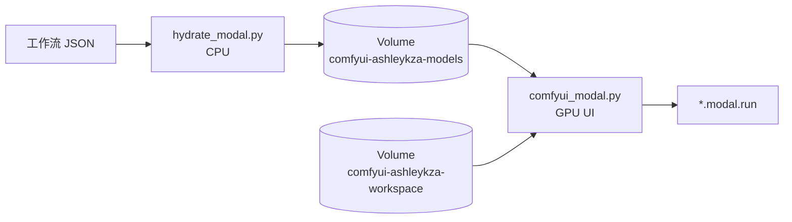

# 核心概念

GPU 容器不负责下载权重。权重只由 CPU Hydrate 写入 Volume；GPU 启动时挂载并做存在性检查。



## 两个 App

| App | 文件 | 作用 |
|---|---|---|
| `{MODAL_APP_NAME}-hydrate` | `hydrate_modal.py` | CPU：解析锁文件、并行下载、`commit()` Volume |
| `MODAL_APP_NAME` | `comfyui_modal.py` | GPU：ComfyUI Web UI |

默认 `MODAL_APP_NAME=comfyui-ashleykza-cu128`。

必须拆开：hydrate 只跑 debian-slim。GPU App 即使默认不装插件，也会加载 Runtime Image。

## 两个 Volume

| Volume | 挂载点 | 用途 |
|---|---|---|
| `comfyui-ashleykza-models` | `/mnt/comfy-storage` | 模型权重（只由 CPU hydrate 写入） |
| `comfyui-ashleykza-workspace` | `/workspace` | input / output / user / logs / custom_nodes（锁内 CNR） |

模型 Volume 的目录名与 ComfyUI `models/<category>/` **同名**：

```text
/mnt/comfy-storage/
  checkpoints/
  diffusion_models/
  text_encoders/
  vae/
  loras/
  .state/comfy.lock.json
  .state/launch.json
  .state/workflow.lock.json
```

GPU 启动时由 `storage.py` 写入 `extra_model_paths.yaml`，把这些目录指给 ComfyUI。默认**不会**再往 `/workspace/models` 下载。若 Volume 里仍有旧布局 `/workspace/models/...`，hydrate 会在写入前把它们提升到 Storage 根目录。

路径只认一种形状。`storage.py` 会去掉重复的 `models/`、`vae/`、`output/` 前缀，所以 `vae/vae/x.safetensors` 和 `output/output/clip.mp4` 不会再被写进去。hydrate / GPU `start()` 还会把已经套层的目录摊平。

## Image 缓存 vs Volume 插件

Modal 按 Image **层**缓存。Ashley 基础镜像 + apt + `typing_extensions` + 固定的 `comfy-cli==1.16.0` 对所有工作流共用。

把某个工作流的 `comfy node registry-install` 或 `add_local_file(lock.json)` 写进 Image，后面那些层会在换 JSON 时全部 miss——看起来就像「每次都重新安装」。

所以锁内 CNR **不进 Image**：

1. hydrate 把锁写到 `.state/launch.json`
2. GPU `start()` 读 Volume，装到 `/workspace/custom_nodes`
3. 目录已在 Volume 上则跳过
4. 需要 `workspace_vol.commit()`，缩容后下次冷启动才能命中 skip

会改 Image、单独占缓存的只有：`COMFY_BASE_NODES=1`、`COMFY_INSTALL_NODES=1`、`COMFY_LATEST=1`。

## GPU 启动路径

`UI` 是带 memory snapshot 的 Modal Cls：

1. `@modal.enter(snap=True)`：读 Volume `.state/launch.json` → 校验模型 → `prepare_runtime()` → 按需把 CNR 装到 workspace Volume → 启动 ComfyUI → 等待 `/system_stats` 返回成功。
2. `@modal.web_server(port=3000)`：进程已在监听，方法体为空。
3. `@modal.exit()`：停止 ComfyUI 进程。

`enable_memory_snapshot` 默认打开；`COMFY_GPU_SNAPSHOT` 默认同开。快照在 **`modal deploy` 之后**才会跨冷启动复用。

## 缩容与并发

- 默认 `scaledown_window=5s`（Modal 允许 2s–20min）。空闲 GPU 很快回到 0，按秒计费。
- 成片写在 Volume `comfyui-ashleykza-workspace` 的 `/output`。GPU 在 `output/` 变化时和容器退出时 `commit()`，所以 5s 缩容后文件还在。
- 取成片用 CPU，不要为了下视频把 PRO 6000 留着：

  ```bash
  modal run hydrate_modal.py --action outputs
  modal volume get comfyui-ashleykza-workspace /output ./output
  ```

- `max_containers=1`：ComfyUI 的队列和用户目录不是无状态服务，避免多容器同时写同一 workspace。
- `@modal.concurrent` 控制单容器可同时处理的输入数（`COMFY_MAX_INPUTS` / `COMFY_TARGET_INPUTS`）。
