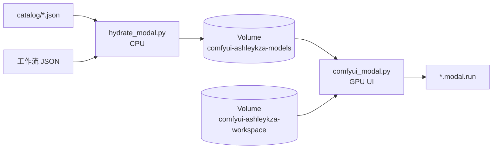

# 核心概念

GPU 容器不负责下载权重。权重只由 CPU Hydrate 写入 Volume；GPU 启动时挂载并做存在性检查。



Studio 顶栏和 `hydrate --catalog` 读同一份 `catalog/*.json`。`recipes.PROFILES` 只给旧模型包，不是产品目录。新配方走 `python3 -m recipe_scaffold`；例外（`mode=graph` / 非 L40S 测试卡 / `queue_*.py`）写在 `catalog/gates.py`。

## 两个 App

| App | 文件 | 作用 |
|---|---|---|
| `{MODAL_APP_NAME}-hydrate` | `hydrate_modal.py` | CPU：解析锁文件、并行下载、`commit()` Volume |
| `MODAL_APP_NAME` | `comfyui_modal.py` | GPU：ComfyUI Web UI |

默认 `MODAL_APP_NAME=comfyui-ashleykza-cu128`。

必须拆开：hydrate 只跑 debian-slim。GPU App 即使默认不装插件，也会加载 Runtime Image。

## 两个 Volume

| Volume | 挂载点 | 用途 |
|---|---|---|
| `comfyui-ashleykza-models` | `/mnt/comfy-storage` | 模型权重（只由 CPU hydrate 写入） |
| `comfyui-ashleykza-workspace` | `/workspace` | input / output / user / logs / custom_nodes（锁内 CNR） |

模型 Volume 的目录名与 ComfyUI `models/<category>/` **同名**：

```text
/mnt/comfy-storage/
  checkpoints/
  diffusion_models/
  text_encoders/
  vae/
  loras/
  cosmos3/
  Pixal3D/
  microsoft/
  facebook/
  .state/comfy.lock.json
  .state/launch.json
  .state/workflow.lock.json
```

GPU 启动时由 `storage.py` 写入 `extra_model_paths.yaml`，把这些目录指给 ComfyUI。默认**不会**再往 `/workspace/models` 下载。若 Volume 里仍有旧布局 `/workspace/models/...`，hydrate 会在写入前把它们提升到 Storage 根目录。

路径只认一种形状。`storage.py` 会去掉重复的 `models/`、`vae/`、`output/` 前缀，所以 `vae/vae/x.safetensors` 和 `output/output/clip.mp4` 不会再被写进去。hydrate / GPU `start()` 还会把已经套层的目录摊平。

## Image 缓存 vs Volume 插件

Modal 按 Image **层**缓存。Ashley 基础镜像 + apt + `typing_extensions` + 固定的 `comfy-cli==1.16.0` 对所有工作流共用。

把某个工作流的 `comfy node registry-install` 或 `add_local_file(lock.json)` 写进 Image，后面那些层会在换 JSON 时全部 miss——看起来就像「每次都重新安装」。

所以锁内 CNR **不进 Image**：

1. hydrate 把锁写到 `.state/launch.json`
2. GPU `start()` 读 Volume，装到 `/workspace/custom_nodes`；Pixal3D / TRELLIS CUDA wheels 装到 `/workspace/.python/sparse-3d`；节点 `requirements.txt` 装到 `/workspace/.python/node-reqs`
3. clone 已在 Volume 上则跳过；`requirements.txt` hash 对上则跳过 `uv pip`，只重写 venv 里的 `.pth`
4. 需要 `workspace_vol.commit()`，缩容后下次冷启动才能命中 skip

会改 Image、单独占缓存的只有：`COMFY_BASE_NODES=1`、`COMFY_INSTALL_NODES=1`、`COMFY_LATEST=1`。

## GPU 启动路径

`UI` 是带 memory snapshot 的 Modal Cls：

1. `@modal.enter(snap=True)`：`prepare_runtime()`（先摊平套层目录）→ 读 Volume `.state/launch.json` → 校验模型 → 按需把 CNR 装到 workspace Volume、把 CUDA wheels 装到 `/workspace/.python/sparse-3d` → 启动 ComfyUI。这一步会打进 `modal deploy` 的快照。
2. `@modal.enter(snap=False)`：每次冷启动（含快照恢复）先 `Volume.reload()`，再按**当前** `launch.json` 校验 / 装 CNR / 挂 CUDA site。指纹没变则沿用快照里的 ComfyUI；换了工作流或新装了 CNR / CUDA site 则重启进程。输出 watch 线程也在这里启动。
3. `@modal.web_server(port=3001)`：进程已在监听，方法体为空。
4. `@modal.exit()`：先 `commit()` workspace Volume，再停止 ComfyUI。

`enable_memory_snapshot` 默认打开；`COMFY_GPU_SNAPSHOT` 默认同开。快照在 **`modal deploy` 之后**才会跨冷启动复用。hydrate 换工作流后不需要重建 Image；下一个 GPU 容器会在 `snap=False` 里读到新的 Volume。

## 缩容与并发

- 默认 `scaledown_window=5s`，并且 `min_containers=0`、`buffer_containers=0`。容器空闲后应回到 0，按秒计费。
- **这不是保活开关。** 下面任何一件事都会让 5 秒缩容根本不会发生，GPU 会一直计费：
  - `modal serve` 进程还在跑，浏览器开着 ComfyUI（WebSocket）
  - 脚本还在轮询 `/system_stats` 或 `/history`
  - `@modal.enter` 还在启动（编译 CUDA 扩展时算启动，不是空闲）
  - 测完没人 `Ctrl+C` / Studio 没点停止
- Studio 生成结束后**默认立刻停掉 serve 并 `modal container stop` 残留容器**。要接着占卡，勾选「继续占着 GPU」。
- 默认 GPU 是 **L40S**，不要用 T4。不要把 `RTX-PRO-6000` 写进 fallback 列表；Modal 会在 L40S 没货时静默换贵卡。
- 成片写在 Volume `comfyui-ashleykza-workspace` 的 `/output`。GPU 在 `output/` 变化时和容器退出时 `commit()`，所以缩容后文件还在。
- 取成片用 CPU，不要为了下视频把贵卡留着：

  ```bash
  modal run hydrate_modal.py --action outputs
  modal volume get comfyui-ashleykza-workspace /output ./output
  ```

- `max_containers=1`：ComfyUI 的队列和用户目录不是无状态服务，避免多容器同时写同一 workspace。
- `@modal.concurrent` 控制单容器可同时处理的输入数（`COMFY_MAX_INPUTS` / `COMFY_TARGET_INPUTS`）。
