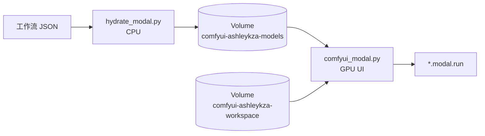

# 核心概念

GPU 容器不负责下载权重。权重只由 CPU Hydrate 写入 Volume；GPU 启动时挂载并做存在性检查。



## 两个 App

| App | 文件 | 作用 |
|---|---|---|
| `{MODAL_APP_NAME}-hydrate` | `hydrate_modal.py` | CPU：解析锁文件、并行下载、`commit()` Volume |
| `MODAL_APP_NAME` | `comfyui_modal.py` | GPU：ComfyUI Web UI |

默认 `MODAL_APP_NAME=comfyui-ashleykza-cu128`。

必须拆开：GPU Image 会按需 `git clone` 大量自定义节点。若在 GPU App 上执行 hydrate，`modal run` 也会解析并构建那份 Image。

## 两个 Volume

| Volume | 挂载点 | 用途 |
|---|---|---|
| `comfyui-ashleykza-models` | `/mnt/comfy-storage` | 模型权重（只由 CPU hydrate 写入） |
| `comfyui-ashleykza-workspace` | `/workspace` | input / output / user / logs |

模型 Volume 的目录名与 ComfyUI `models/<category>/` **同名**：

```text
/mnt/comfy-storage/
  checkpoints/
  diffusion_models/
  text_encoders/
  vae/
  loras/
  .state/comfy.lock.json
```

GPU 启动时由 `storage.py` 写入 `extra_model_paths.yaml`，把这些目录指给 ComfyUI。默认**不会**再往 `/workspace/models` 下载。若 Volume 里仍有旧布局 `/workspace/models/...`，hydrate 会在写入前把它们提升到 Storage 根目录。

## GPU 启动路径

`UI` 是带 memory snapshot 的 Modal Cls：

1. `@modal.enter(snap=True)`：若 Image 内嵌了工作流锁，则校验 Storage 中的文件 → `prepare_runtime()` → 启动 ComfyUI → 等待 `/system_stats` 返回成功。
2. `@modal.web_server(port=3000)`：进程已在监听，方法体为空。
3. `@modal.exit()`：停止 ComfyUI 进程。

`enable_memory_snapshot` 默认打开；`COMFY_GPU_SNAPSHOT` 默认同开。快照在 **`modal deploy` 之后**才会跨冷启动复用。

## 缩容与并发

- 默认 `scaledown_window=5s`（Modal 允许 2s–20min）。空闲 GPU 很快回到 0，按秒计费。
- `max_containers=1`：ComfyUI 的队列和用户目录不是无状态服务，避免多容器同时写同一 workspace。
- `@modal.concurrent` 控制单容器可同时处理的输入数（`COMFY_MAX_INPUTS` / `COMFY_TARGET_INPUTS`）。
